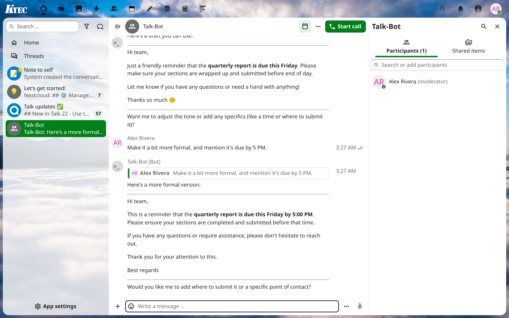
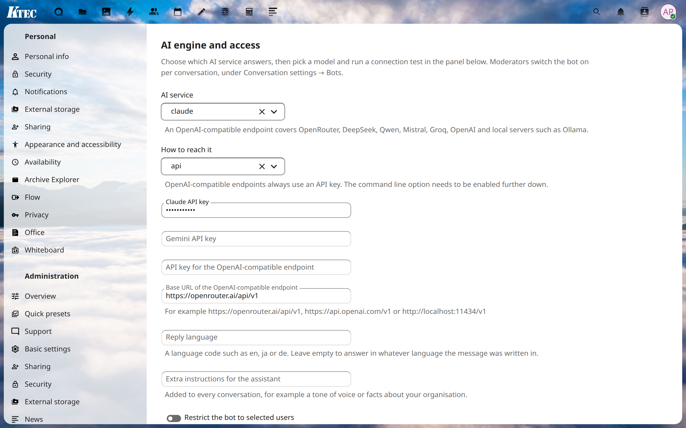
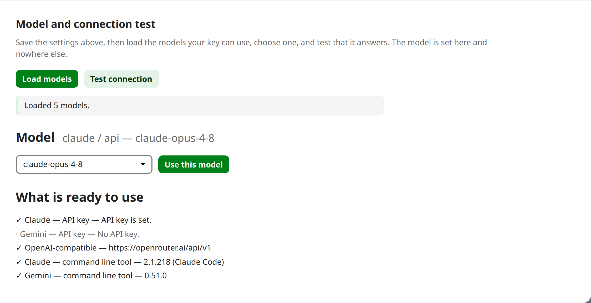

# Talk Bot / トークボット

**Chat with Claude, Gemini or any OpenAI-compatible model right inside Nextcloud Talk.**
**Nextcloud Talk の中で Claude / Gemini / OpenAI互換モデルと会話できるボット。**

> One small PHP app. No external daemon, no webhook endpoint, no Docker, no separate machine. Bring an API key — or a CLI subscription.
> 数百KBのPHPアプリ1つ。外部デーモンもWebhookの受け口もDockerも別マシンも不要。APIキー、あるいはCLIのサブスクだけで動きます。

[English ↓](#english) · [日本語 ↓](#japanese)

---

## Screenshots

| | |
|---|---|
|  |  |
| Answering in a Talk conversation Talk の会話で応答しているところ | Admin settings 管理設定 |
|  | |
| Model list and connection test モデル一覧と接続テスト | |

---

## English

Talk Bot turns any Nextcloud Talk conversation into an AI chat. It runs as a Talk
in-app bot, entirely inside Nextcloud — a few hundred kilobytes of PHP, installed
from the App Store like any other app. There is no separate service to install and
keep running, and it answers off the request path, so posting a message never
waits for the model.

### Bring your own model — or your own subscription

- **Native and OpenAI-compatible.** Anthropic Claude and Google Gemini through
  their own APIs, plus any OpenAI-compatible endpoint: OpenRouter, DeepSeek,
  Qwen/DashScope, Mistral, Groq, OpenAI itself, or a local server such as Ollama,
  vLLM or LM Studio.
- **Use a CLI subscription instead of API tokens.** If a Claude or Gemini command
  line tool is installed on the server, the bot can drive it, so a flat-rate
  subscription answers your users with no per-token API bill. Off by default.
- **Pick the model from a list.** The settings page fetches the models your key
  can actually use, so there is nothing to type by hand and only one place to set
  it. A connection test confirms it answers before your users try it.

### Two tiers: helpers for everyone, maintenance for admins

- **Ordinary users get a sandbox.** No tools, no files, no shell, no way to touch
  the server — just an assistant that answers questions.
- **Administrators can get real access, only when you turn it on.** With the CLI
  engine, you may grant the Nextcloud admin group tools that run with the web
  server's rights, so an admin can look into and maintain the server straight from
  a Talk conversation. Everyone who is not an administrator stays in the sandbox.
  Both tiers are empty by default.

### And the rest

- **Per-conversation memory.** Every user keeps their own history in every room.
- **Slash commands** — `/help`, `/reset`, `/status`.
- **Access control.** Optionally restrict the bot to an allow-list of users.
- **Reply language.** Answer always in a fixed language, or mirror the user.

### Requirements

- Nextcloud 30 – 32 with the **Talk** app
- PHP 8.1 or newer
- An API key for the service you choose, or a Claude/Gemini command line tool
  (and its subscription login) on the server

### Setup

1. Install and enable the app.
2. Go to **Administration settings → Talk Bot**, choose the AI service and enter
   the API key, then save.
3. In the panel below the form, press **Load models**, choose a model, press
   **Use this model**, and then **Test connection**.
4. In any conversation, a moderator opens **Conversation settings → Bots** and
   switches **Talk Bot** on.
5. Write a message. The bot reacts with 💭 while it thinks and then answers.

### How it answers without blocking the chat

Talk calls in-app bots while the sender's message is still being posted, so the
model is not called there. The bot hands the work to a second request addressed
to this server, stops waiting for it after two seconds, and that request posts
the answer through Talk's bot API when the model is done. If the server cannot
reach itself over HTTP, the work falls back to a background job instead, and the
answer arrives with the next cron run.

### Letting admins maintain the server (optional)

Off unless you ask for it. With the command line engine selected, set **Tools for
Nextcloud administrators** in the settings — `default` for all tools, or a list
such as `Bash,Read,Edit`. From then on, a member of the admin group can ask the
bot to look into logs, check a config value or fix something, straight from a Talk
conversation; it runs with the web server's rights. Non-admins are unaffected and
stay in the sandbox. Leave the field empty and nobody gets tools.

### Privacy and security

- Messages sent to the bot go to the AI provider you configured, and nowhere
  else. Point it at a local model server and nothing leaves the machine.
- API keys and the bot secret are stored encrypted in the Nextcloud
  configuration, and are never sent back to the browser.
- By default the bot has no tools at all: it cannot read files, run commands or
  reach anything on your server. Tools exist only for the command line engine, are
  empty until you set them, and even then reach ordinary users and administrators
  through two separate, independently-set lists.

### Commands

| Command | Effect |
|---|---|
| `/help` | Show the command list |
| `/reset` | Forget this conversation and start over |
| `/status` | Show the engine, model and how much is remembered |

---

## 日本語

トークボットは、Nextcloud Talk の会話をそのまま AI チャットにするアプリです。
Talk のアプリ内ボットとして、数百KBの PHP だけで Nextcloud の中だけで動きます。
App Store から普通のアプリと同じように入れるだけで、別に動かし続けるサービスは
ありません。応答はリクエストの外で作るので、メッセージの送信が生成完了まで
待たされることもありません。

### 好きなモデルを、あるいは手持ちのサブスクを

- **ネイティブ＋OpenAI互換。** Anthropic Claude と Google Gemini はネイティブAPIで、
  さらに OpenAI互換のエンドポイント（OpenRouter・DeepSeek・Qwen/DashScope・Mistral・
  Groq・OpenAI 本家、Ollama や vLLM、LM Studio などのローカルサーバー）に対応します。
- **APIトークンの代わりにCLIのサブスクを使えます。** サーバーに Claude や Gemini の
  コマンドラインツールが入っていれば、ボットがそれを使えます。定額サブスクで応答でき、
  従量課金のAPI料金は不要です。既定では無効です。
- **モデルは一覧から選べます。** 設定画面がキーで実際に使えるモデルを取得するので、
  手で打つ必要はなく、指定する場所も1か所だけです。接続テストで、利用者より先に応答を
  確認できます。

### 二段構え：全員にはアシスタント、管理者にはメンテナンスも

- **一般ユーザーはサンドボックス。** ツールなし・ファイルなし・シェルなし。サーバーに
  触れる手段はなく、質問に答えるだけのアシスタントです。
- **管理者には、有効化したときだけ本当のアクセスを。** CLIエンジン利用時に限り、
  Nextcloud の admin グループへ Webサーバー権限で動くツールを与えられます。Talk の
  会話からそのままサーバーを調べ、メンテナンスできます。管理者以外は常にサンドボックス
  のままです。どちらの段も既定では空（＝無効）です。

### その他

- **会話ごとの記憶。** 各ユーザーが各ルームで自分の履歴を保持します。
- **スラッシュコマンド** — `/help`、`/reset`、`/status`。
- **利用制限。** 許可ユーザーの一覧で利用者を絞れます。
- **返答の言語。** 常に特定の言語で返す／利用者に合わせる、を選べます。

### 動作条件

- Nextcloud 30 〜 32 と **Talk** アプリ
- PHP 8.1 以降
- 選んだサービスのAPIキー、またはサーバー上の Claude/Gemini コマンドラインツール
  （とそのサブスクリプションのログイン）

### 設定手順

1. アプリをインストールして有効化します。
2. **管理者設定 → トークボット** で AI サービスを選び、APIキーを入力して保存します。
3. フォームの下のパネルで **モデルを取得** → モデルを選択 → **このモデルを使う** →
   **接続テスト** の順に実行します。
4. 使いたい会話で、モデレーターが **会話の設定 → ボット** を開き、**Talk Bot** を
   オンにします。
5. メッセージを書くと、考えている間は 💭 が付き、その後に返答が届きます。

### チャットを止めずに応答する仕組み

Talk はアプリ内ボットを「送信者のメッセージを投稿している最中」に呼び出すため、
そこでモデルを呼ぶことはしません。ボットは自サーバー宛の2つ目のリクエストに処理を
渡し、2秒待って待機をやめます。そのリクエストは、モデルの応答が出た時点で Talk の
ボットAPI経由で返答を投稿します。サーバーが自分自身にHTTPで到達できない場合は、
バックグラウンドジョブに退避し、次のcron実行で返答が届きます。

### 管理者によるサーバーメンテナンス（任意）

指定しない限り無効です。CLIエンジンを選んだうえで、設定の **Nextcloud管理者向けの
ツール** に値を入れます（全ツールなら `default`、あるいは `Bash,Read,Edit` のような
一覧）。以降、admin グループのメンバーは、ログの確認・設定値の参照・修正などを、Talk の
会話からそのままボットに頼めます（Webサーバー権限で動作）。管理者以外は影響を受けず、
サンドボックスのままです。空欄なら、誰にもツールは与えられません。

### プライバシーとセキュリティ

- ボットに送ったメッセージは、設定したAIプロバイダーにのみ送信されます。ローカルの
  モデルサーバーを指定すれば、データはサーバーの外に出ません。
- APIキーとボットのシークレットは Nextcloud の設定に暗号化して保存され、ブラウザーへ
  返されることはありません。
- 既定ではボットはツールを一切持ちません。ファイルの読み取り、コマンドの実行、サーバー
  上のリソースへの到達はできません。ツールはCLIエンジンにのみ存在し、設定するまでは空、
  設定後も一般ユーザーと管理者で別々に指定する2つの一覧を通して与えられます。

### コマンド

| コマンド | 動作 |
|---|---|
| `/help` | コマンド一覧を表示します |
| `/reset` | この会話を忘れて最初からやり直します |
| `/status` | エンジン・モデル・記憶量を表示します |

---

[AGPL-3.0-or-later](LICENSE) · © KTEC
