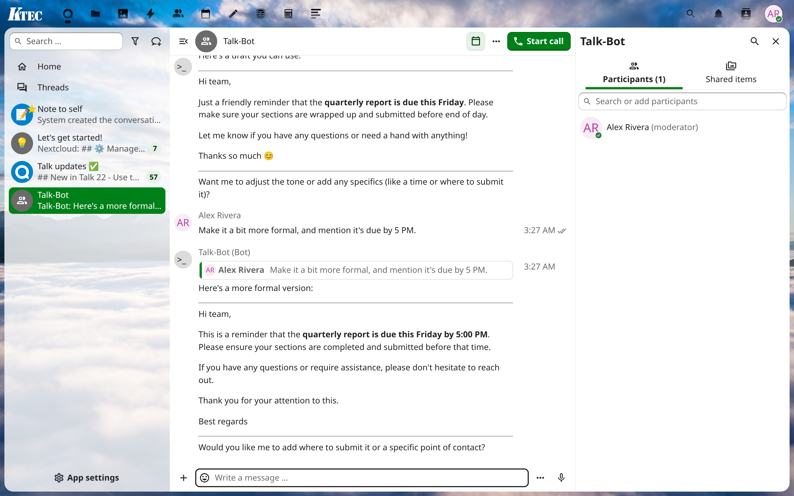
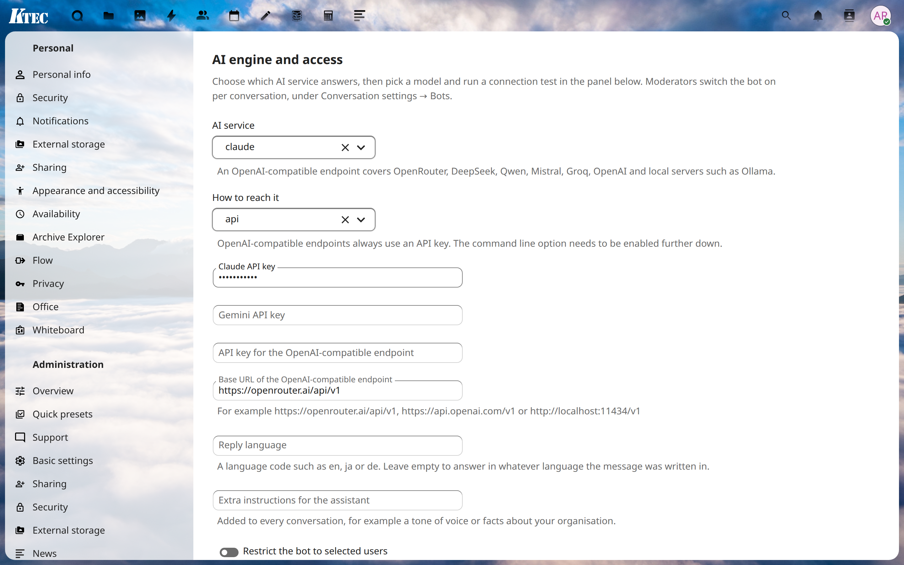
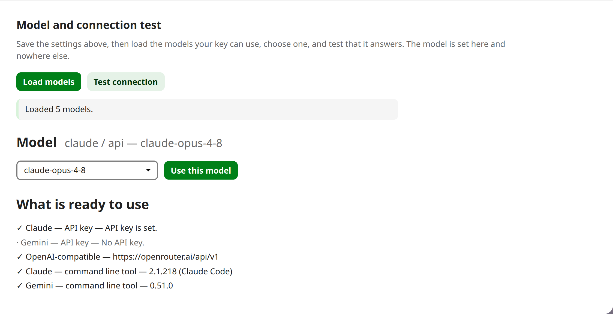

# Talk-Bot

**Chat with Claude, Gemini or any OpenAI-compatible model right inside Nextcloud Talk.**
**Nextcloud Talk の中で Claude / Gemini / OpenAI互換モデルと会話できるボット。**

> One small PHP app. No external daemon, no webhook endpoint, no Docker, no separate machine. Bring an API key — or a CLI subscription.
> 数百KBのPHPアプリ1つ。外部デーモンもWebhookの受け口もDockerも別マシンも不要。APIキー、あるいはCLIのサブスクだけで動きます。

[English ↓](#english) · [日本語 ↓](#japanese)

---

## Screenshots

| | |
|---|---|
|  |  |
| Answering in a Talk conversation Talk の会話で応答しているところ | Admin settings 管理設定 |
|  | |
| Model list and connection test モデル一覧と接続テスト | |

---

## English

Talk-Bot turns any Nextcloud Talk conversation into an AI chat. It runs as a Talk
in-app bot, entirely inside Nextcloud — a few hundred kilobytes of PHP, installed
from the App Store like any other app. There is no separate service to install and
keep running, and it answers off the request path, so posting a message never
waits for the model.

### Bring your own model — or your own subscription

- **Native and OpenAI-compatible.** Anthropic Claude and Google Gemini through
  their own APIs, plus any OpenAI-compatible endpoint: OpenRouter, DeepSeek,
  Qwen/DashScope, Mistral, Groq, OpenAI itself, or a local server such as Ollama,
  vLLM or LM Studio.
- **Use a CLI subscription instead of API tokens.** If a Claude or Gemini command
  line tool is installed on the server, the bot can drive it, so a flat-rate
  subscription answers your users with no per-token API bill. Off by default.
- **Pick the model from a list.** The settings page fetches the models your key
  can actually use, so there is nothing to type by hand and only one place to set
  it. A connection test confirms it answers before your users try it.

### Two tiers: helpers for everyone, maintenance for admins

- **Ordinary users get a sandbox.** No tools, no files, no shell, no way to touch
  the server — just an assistant that answers questions.
- **Administrators can get real access, only when you turn it on.** With the CLI
  engine, you may grant the Nextcloud admin group tools that run with the web
  server's rights, so an admin can look into and maintain the server straight from
  a Talk conversation. Everyone who is not an administrator stays in the sandbox.
  Both tiers are empty by default.

### And the rest

- **Per-conversation memory.** Every user keeps their own history in every room. Optionally forget it a set number of days after the last message (default: kept until `?reset`).
- **Fair use.** Limit questions per user per minute and how many answers are worked on at once, per user and in total.
- **Commands** — `?help`, `?reset`, `?status`, `?model`, `?update`.
- **Access control.** Optionally restrict the bot to an allow-list of users.
- **Reply language.** Answer always in a fixed language, or mirror the user.

### Requirements

- Nextcloud 31 – 35 with the **Talk** app (Talk 21 or later: Nextcloud 30 / Talk 20 cannot run bots of this kind)
- PHP 8.1 or newer
- An API key for the service you choose, or a Claude/Gemini command line tool
  (and its subscription login) on the server

### Setup

1. Install and enable the app.
2. Go to **Administration settings → Talk-Bot**, choose the AI service and enter
   the API key, then save.
3. In the panel below the form, press **Load models**, choose a model, press
   **Use this model**, and then **Test connection**.
4. In any conversation, a moderator opens **Conversation settings → Bots** and
   switches **Talk-Bot** on.
5. Write a message. The bot reacts with 💭 while it thinks and then answers.

### How it answers without blocking the chat

Talk calls in-app bots while the sender's message is still being posted, so the
model is not called there. The bot hands the work to a second request addressed
to this server, stops waiting for it after two seconds, and that request posts
the answer through Talk's bot API when the model is done. If the server cannot
reach itself over HTTP, the work falls back to a background job instead, and the
answer arrives with the next cron run.

### Administrator privileges, in detail

By default the bot only talks. The ability to touch the server — read files, run
shell commands, edit configuration — is an opt-in feature of the **command line
engine**, and it is split into two independent tiers that are decided from each
sender's Nextcloud account.

**Who counts as an administrator.** A request is treated as *elevated* only when
all four of these are true:

1. the sender is a member of the Nextcloud **admin group**,
2. the **command line** engine is the selected way to reach the model, and
3. the **Tools for Nextcloud administrators** field is not empty, and
4. the conversation is one where nobody else reads the answer: the administrator's
   one-to-one conversation with **the bot's own Talk account** (a setting), or a
   conversation the administrator is alone in.

Because the first condition is Nextcloud's own admin group, administrator power
follows your existing roles automatically: promote or demote someone in Nextcloud
and their bot access changes with them. There is no separate "bot admin" list to
keep in sync.

**What each tier can do.**

- **Ordinary users — sandboxed.** No tools whatsoever. The bot answers questions
  and nothing more: it cannot open a file, run a command, or reach anything on the
  server.
- **Administrators — elevated (only when enabled).** The bot runs the command line
  tool with the tools you granted, **with the rights of the account Nextcloud runs
  as** — its web server / PHP process user, whose name varies by system. Within
  that account's reach it can inspect logs, read and change configuration, edit
  files and run commands — all from a Talk message.

**The two settings, set independently.**

- **Tools for ordinary users** (`cli_user_tools`) — empty by default, and best
  left that way. If you do fill it, keep it to a safe, read-only kind of list such
  as `WebSearch`.
- **Tools for Nextcloud administrators** (`cli_admin_tools`) — empty by default.
  `default` grants every available tool; or name exactly the tools you want, for
  example `Bash,Read,Edit`.

**Understand the reach before you enable it.** An elevated request is as capable
as a shell running as the account Nextcloud runs as. That is not root, but on a typical
install it is still full control over Nextcloud's own files and data. Every member
of the admin group gets this, and it is triggered by an ordinary chat message — so
enable it deliberately: leave the field empty unless you truly want it, and prefer
a short explicit list over `default` when a few tools are enough.

**Checking and revoking.**

- Anyone can send **`?whoami`** to see which tier they are in.
- **`?status`** — or `occ ktec_talkbot:status` on the server — shows both tool
  lists and the current engine.
- To switch it off again, clear the **Tools for Nextcloud administrators** field;
  administrators drop straight back to the sandbox.

### Privacy and security

- Messages sent to the bot go to the AI provider you configured, and nowhere
  else. Point it at a local model server and nothing leaves the machine.
- API keys and the bot secret are stored encrypted in the Nextcloud
  configuration, and are never sent back to the browser.
- By default the bot has no tools at all: it cannot read files, run commands or
  reach anything on your server. Tools exist only for the command line engine, are
  empty until you set them, and even then reach ordinary users and administrators
  through two separate, independently-set lists.

### Commands

| Command | Effect |
|---|---|
| `?help` | Show the command list |
| `?reset` | Forget this conversation and start over |
| `?status` | Show the engine, model and how much is remembered |
| `?whoami` | Show your access level — sandboxed, or which admin tools you have |
| `?model` | Show the model in use and the models it can be switched to |
| `?model <name or number>` | Switch the model (administrators only) |
| `?update` | Update the Claude Code the bot uses (administrators only) |

### Switching the model and updating Claude Code from the chat

- **`?model`** lists the models it can be switched to. With Claude Code, the list is read from the Claude Code installed on the server, so it always matches what that version knows — no list in the app to fall behind.
- **`?model <name>`** or **`?model <number>`** switches, for administrators. Before switching, the bot sends the model one short test message; it switches only if an answer comes back. A name Claude Code does not accept is refused with its reason, and the model stays as it was. (The test message costs a few cents and takes a few seconds.)
- The short names **`fable`, `opus`, `sonnet`, `haiku`** always mean the newest model of that kind; the reply tells you which model actually answers.
- **`?update`** updates the Claude Code the bot uses, for administrators. The bot says it is checking, then posts the result: the old and new version, or that it is already up to date — and any models the new version adds. Only one update runs at a time.

---

## 日本語

Talk-Bot は、Nextcloud Talk の会話をそのまま AI チャットにするアプリです。
Talk のアプリ内ボットとして、数百KBの PHP だけで Nextcloud の中だけで動きます。
App Store から普通のアプリと同じように入れるだけで、別に動かし続けるサービスは
ありません。応答はリクエストの外で作るので、メッセージの送信が生成完了まで
待たされることもありません。

### 好きなモデルを、あるいは手持ちのサブスクを

- **ネイティブ＋OpenAI互換。** Anthropic Claude と Google Gemini はネイティブAPIで、
  さらに OpenAI互換のエンドポイント（OpenRouter・DeepSeek・Qwen/DashScope・Mistral・
  Groq・OpenAI 本家、Ollama や vLLM、LM Studio などのローカルサーバー）に対応します。
- **APIトークンの代わりにCLIのサブスクを使えます。** サーバーに Claude や Gemini の
  コマンドラインツールが入っていれば、ボットがそれを使えます。定額サブスクで応答でき、
  従量課金のAPI料金は不要です。既定では無効です。
- **モデルは一覧から選べます。** 設定画面がキーで実際に使えるモデルを取得するので、
  手で打つ必要はなく、指定する場所も1か所だけです。接続テストで、利用者より先に応答を
  確認できます。

### 二段構え：全員にはアシスタント、管理者にはメンテナンスも

- **一般ユーザーはサンドボックス。** ツールなし・ファイルなし・シェルなし。サーバーに
  触れる手段はなく、質問に答えるだけのアシスタントです。
- **管理者には、有効化したときだけ本当のアクセスを。** CLIエンジン利用時に限り、
  Nextcloud の admin グループへ Webサーバー権限で動くツールを与えられます。Talk の
  会話からそのままサーバーを調べ、メンテナンスできます。管理者以外は常にサンドボックス
  のままです。どちらの段も既定では空（＝無効）です。

### その他

- **会話ごとの記憶。** 各ユーザーが各ルームで自分の履歴を保持します。最後の発言から決めた日数で忘れるようにもできます（既定は `?reset` まで残す）。
- **使いすぎの防止。** 1 人あたり 1 分間の質問数と、同時に作成中の回答の数（1 人あたり・全員合わせて）を制限できます。
- **コマンド** — `?help`、`?reset`、`?status`、`?model`、`?update`。
- **利用制限。** 許可ユーザーの一覧で利用者を絞れます。
- **返答の言語。** 常に特定の言語で返す／利用者に合わせる、を選べます。

### 動作条件

- Nextcloud 31 〜 35 と **Talk** アプリ（Talk 21 以降。Nextcloud 30 / Talk 20 ではこの形のボットは動きません）
- PHP 8.1 以降
- 選んだサービスのAPIキー、またはサーバー上の Claude/Gemini コマンドラインツール
  （とそのサブスクリプションのログイン）

### 設定手順

1. アプリをインストールして有効化します。
2. **管理者設定 → Talk-Bot** で AI サービスを選び、APIキーを入力して保存します。
3. フォームの下のパネルで **モデルを取得** → モデルを選択 → **このモデルを使う** →
   **接続テスト** の順に実行します。
4. 使いたい会話で、モデレーターが **会話の設定 → ボット** を開き、**Talk-Bot** を
   オンにします。
5. メッセージを書くと、考えている間は 💭 が付き、その後に返答が届きます。

### チャットを止めずに応答する仕組み

Talk はアプリ内ボットを「送信者のメッセージを投稿している最中」に呼び出すため、
そこでモデルを呼ぶことはしません。ボットは自サーバー宛の2つ目のリクエストに処理を
渡し、2秒待って待機をやめます。そのリクエストは、モデルの応答が出た時点で Talk の
ボットAPI経由で返答を投稿します。サーバーが自分自身にHTTPで到達できない場合は、
バックグラウンドジョブに退避し、次のcron実行で返答が届きます。

### 管理者権限の詳細

既定では、ボットは会話するだけです。サーバーに触れる力——ファイルの読み取り、シェル
コマンドの実行、設定の変更——は **CLIエンジン** の任意機能で、送信者の Nextcloud
アカウントから判定される、独立した二段構えになっています。

**誰が「管理者」として扱われるか。** リクエストが *昇格* 扱いになるのは、次の4つが
すべて満たされたときだけです。

1. 送信者が Nextcloud の **admin グループ** のメンバーであること、
2. モデルへの接続方法として **コマンドライン** エンジンが選ばれていること、
3. **Nextcloud管理者向けのツール** の欄が空でないこと、
4. ほかの人に答えが見えない会話であること。つまり、管理者と **ボット用の Talk アカウント**（設定で指定）
   だけの 1 対 1 の会話か、管理者ひとりだけの会話。

1つ目の条件が Nextcloud 自身の admin グループなので、管理者権限は既存の役割に自動で
連動します。Nextcloud 側で管理者に昇格・降格すれば、ボットのアクセスもそれに従います。
別途「ボット管理者」の一覧を管理する必要はありません。

**各段でできること。**

- **一般ユーザー — サンドボックス。** ツールは一切ありません。質問に答えるだけで、
  ファイルを開くことも、コマンドを実行することも、サーバー上の何かに到達することも
  できません。
- **管理者 — 昇格（有効化したときのみ）。** ボットは、あなたが与えたツールとともに、
  **Nextcloud を実行しているアカウント**（Web サーバー／PHP プロセスの実行ユーザー。
  名称はシステムにより異なります）の権限でコマンドラインツールを動かします。その
  アカウントの権限が届く範囲で、ログの確認・設定の参照と変更・ファイルの編集・
  コマンドの実行を、Talk のメッセージから行えます。

**2つの設定は別々に指定します。**

- **一般ユーザー向けのツール**（`cli_user_tools`）— 既定は空で、そのままを推奨します。
  入れる場合も、`WebSearch` のような安全で読み取り中心の一覧にとどめてください。
- **Nextcloud管理者向けのツール**（`cli_admin_tools`）— 既定は空。`default` で全ツールを
  付与、あるいは `Bash,Read,Edit` のように必要なツールだけを指定します。

**有効化する前に、及ぶ範囲を理解してください。** 昇格したリクエストは、Nextcloud を
実行しているアカウントとして動くシェルと同等の力を持ちます。root ではありませんが、一般的な構成では
Nextcloud 自身のファイルとデータを完全に操作できます。これを admin グループの全員が得て、
しかも普通のチャットメッセージで発動します。ですから有効化は慎重に——本当に必要でない
限り欄は空のままにし、少数のツールで足りるなら `default` ではなく明示的な短い一覧を
選んでください。

**確認と解除。**

- 誰でも **`?whoami`** を送れば、自分がどちらの段かを確認できます。
- **`?status`**（サーバー上では `occ ktec_talkbot:status`）で、両方のツール一覧と現在の
  エンジンが分かります。
- 無効に戻すには、**Nextcloud管理者向けのツール** の欄を空にします。管理者はただちに
  サンドボックスへ戻ります。

### プライバシーとセキュリティ

- ボットに送ったメッセージは、設定したAIプロバイダーにのみ送信されます。ローカルの
  モデルサーバーを指定すれば、データはサーバーの外に出ません。
- APIキーとボットのシークレットは Nextcloud の設定に暗号化して保存され、ブラウザーへ
  返されることはありません。
- 既定ではボットはツールを一切持ちません。ファイルの読み取り、コマンドの実行、サーバー
  上のリソースへの到達はできません。ツールはCLIエンジンにのみ存在し、設定するまでは空、
  設定後も一般ユーザーと管理者で別々に指定する2つの一覧を通して与えられます。

### コマンド

| コマンド | 動作 |
|---|---|
| `?help` | コマンド一覧を表示します |
| `?reset` | この会話を忘れて最初からやり直します |
| `?status` | エンジン・モデル・記憶量を表示します |
| `?whoami` | 自分の権限レベル（サンドボックス／付与された管理者ツール）を表示します |
| `?model` | 使用中のモデルと、切り替えられるモデルを表示します |
| `?model <名前か番号>` | モデルを切り替えます（管理者のみ） |
| `?update` | ボットが使う Claude Code を更新します（管理者のみ） |

### チャットからモデルを切り替え、Claude Code を更新する

- **`?model`** で、切り替えられるモデルを一覧にします。Claude Code を使うときは、サーバーに入っている Claude Code 自体から一覧を読み取るので、その版が知っているモデルといつも一致します。アプリ内の一覧が古くなることはありません。
- **`?model <名前>`** または **`?model <番号>`** で、管理者が切り替えます。切り替える前に、そのモデルへ短い試しの一言を送り、答えが返ったときだけ切り替えます。Claude Code が受け付けない名前は理由を添えて断り、モデルはそのままです（試しの一言は数セント・数秒かかります）。
- 短い名前 **`fable`・`opus`・`sonnet`・`haiku`** は、それぞれの種類の最新モデルを指します。実際にどのモデルが答えるかを返事に添えます。
- **`?update`** で、管理者がボットの使う Claude Code を更新します。「確かめています」とすぐ返し、終わると結果（前後の版、または最新であること）と、新しい版で使えるようになったモデルを投稿します。更新は同時に一つしか走りません。

---

[AGPL-3.0-or-later](LICENSE) · © KTEC
